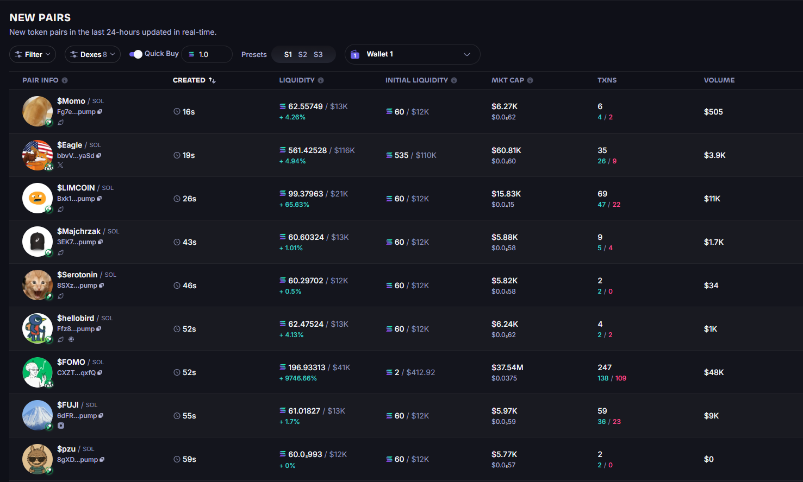
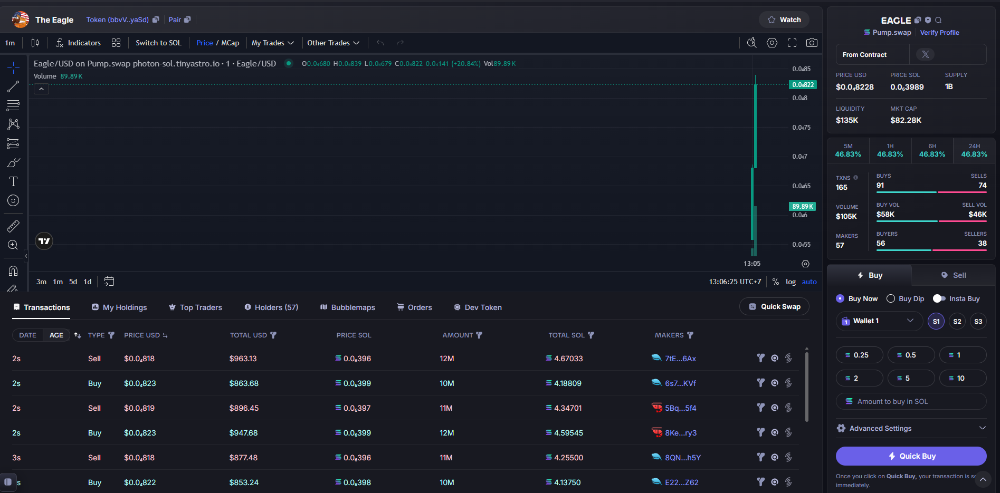

# Solana DEX Scraper (Photon-Style Data)

A **high-performance Solana DEX scraper** designed to replicate and extend Photon’s style of market data.  
Built in **JavaScript** with **gRPC + RPC** for maximum efficiency.  

We focus on two key pages:  

- 📌 **New Pair Page** – fresh markets as they launch  
- 📌 **Pair Data Page** – detailed live stats on tracked markets  

---

## ⚡ Performance

- 🚀 Process an entire Solana block in **under 60ms**  
- 🛰 Minimal RPC usage → most data streamed via **gRPC**  
- 🛠 Designed for **real-time trading dashboards, bots, and analytics**

---

## 📊 Supported Protocols

We currently track pools across all major Solana DEXes:

- **Raydium** → AMM, CPMM, CLMM  
- **Pump.fun** → Bonding Curve, AMM  
- **Orca** → Whirlpool (WP)  
- **Meteora** → DAMM, DLMM, V2 pools  

---

## 🔍 What We Track

The scraper listens to **every critical on-chain event**:  

- 💱 **Swaps** – all trades across supported pools  
- 💧 **Liquidity Events** – deposits, withdrawals, position updates  
- 🆕 **Pool Creations** – detect new markets the moment they launch  

This ensures you always have **the full picture of market activity** in real-time.

---

## 🔌 How It Works

- **gRPC**  
  - Subscribe to all relevant program transactions (fast, low-latency feed)  

- **RPC WebSocket**  
  - Token Program  
  - Metaplex  
  - ALT Program  
  - → Keeps critical data updated with *minimal* RPC calls  

- **Provider Agnostic**  
  - Based on [Shyft](https://shyft.to)  
  - Works with **any gRPC/RPC provider**

---

## 🖼 Screenshots

### New Pair Page

### Pair Data Page

---

## 💰 Pricing

We offer two options:  

- **As-Is Access** → Use the scraper with default configuration for as cheap as 1k USD
- **Customized Deployment** → Tailored filters, integrations, and performance tweaks for your workflow & UI/API - CONTACT ME (Start at 5k USD)

---

## ✨ Why Choose This Scraper?

- ⚡ **Ultra-fast** → Full block parsed in <60ms  
- 🔧 **Plug & Play** → Works out-of-the-box with any gRPC/RPC endpoint  
- 🧠 **Smart Design** → Minimal RPC overhead, all critical data live  
- 🌍 **Comprehensive Coverage** → Raydium, Pump.fun, Orca, Meteora all supported  
- 📊 **Complete Tracking** → Swaps, liquidity events, and new pool creation  
- 📈 **Scalable** → Built for bots, dashboards, indexers, and research  
